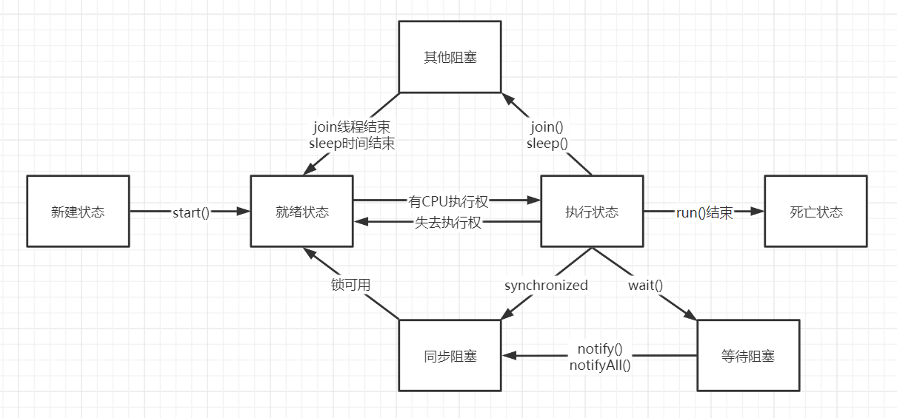
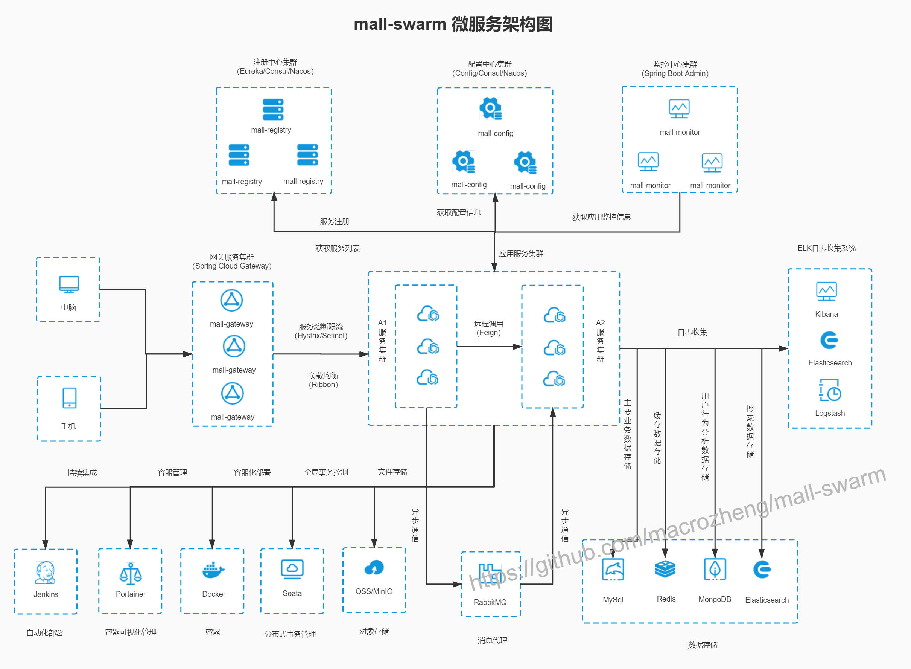

# 概念性知识

- `Java`：跨平台、可移植性强，面向对象语言，源于C/C++，GC机制

- 面向对象：把相关的数据和方法组织为一个整体来看待
  - 封装：模块化，信息隐藏
  - 继承：纵向层次结构，提高代码可复用性
  - 多态：面向接口编程，减少代码的复杂度。具体实现：动态绑定机制

- `JDK`, `JRE`, `JVM`
  - `JVM(Java Virtual Machine)` : 整个Java实现跨平台的最核心的部分，能够运行以Java语言写作的软件程序
  - `JRE(Java Runtime Environment)` : 是运行Java程序所必须的环境的集合，包含JVM标准实现及Java核心类库
  - `JDK(Java Development Kit)` : 是针对Java开发人员的产品，是整个Java的核心，包括了JRE、Java开发工具和Java基础类库


- 关系型数据库
- 非关系型数据库
- `Redis`
- `SSM` : `Spring`, `SpringMVC`, `MyBatis`
- `SpringAOP`
- `Springboot`
- `SpringCloud`

- `Nginx`

- `RestTemplate`

- 服务注册中心

- `Ribbon`

- `OpenFeign`：面向接口的服务调用，指定服务名、请求方法、请求参数

- 服务配置中心：配置项，配置集（DataId：服务名-多环境配置.文件格式），配置分组，命名空间，bootstrap.yml

- `tk-MyBatis`：简化MyBatis操作

- `MapStruct`：使用纯Java的方法调用源对象和目标对象之间进行映射，并非Java反射机制

- `SPI`

- `Gateway`

- `RocketMQ`

- `ElasticSearch`

- 分布式事务：CAP理论，BaSE理论，刚性事务，柔性事务，XA/2PC，TCC，本地消息表，RocketMQ事务消息

- 限流


# SE

## 多线程:ok:

### Thread类

```java
public class Thread implements Runnable {
    
    /* What will be run. */
    private Runnable target;
    
    private volatile int threadStatus = 0;
    
    // 构造方法无参
    public Thread() {
        init(null, null, "Thread-" + nextThreadNum(), 0);
    }
    // 构造方法Runnable
    public Thread(Runnable target) {
        init(null, target, "Thread-" + nextThreadNum(), 0);
    }
    
    // run方法，继承自Runnable接口
    @Override
    public void run() {
        if (target != null) {
            target.run();
        }
    }
    
    // start方法，同步方法
	public synchronized void start() {
		// 同一个对象不能启动多次
        if (threadStatus != 0)
            throw new IllegalThreadStateException();

        group.add(this);

        boolean started = false;
        try {
            // 调用本地方法start0()，开启新的执行路径
            start0();
            started = true;
        } finally {
            try {
                if (!started) {
                    group.threadStartFailed(this);
                }
            } catch (Throwable ignore) {
                /* do nothing. If start0 threw a Throwable then
                  it will be passed up the call stack */
            }
        }
    }
    
    // 返回对当前正在执行的线程对象的引用
    public static native Thread currentThread();
}

// 功能接口
@FunctionalInterface
public interface Runnable {
    public abstract void run();
}
```

### 线程状态转换



## 设计模式:ok:

### 单例设计模式

- 参考文档：[深入理解单例设计模式 - SegmentFault 思否 ](https://segmentfault.com/a/1190000040146574) 写得真的好！
- 优点：
  - 在内存中只有一个对象，节省内存空间；
  - 避免频繁的创建销毁对象，减轻 GC 工作，同时可以提高性能；
  - 避免对共享资源的多重占用，简化访问；
  - 为整个系统提供一个全局访问点。

- 实现步骤：
  1. 只有 `private` 构造方法，确保外部无法实例化
  2. 通过 `private static` 变量持有唯一实例，保证全局唯一性
  3. 通过 `public static` 方法返回此唯一实例，使外部调用方能获取到实例
  4. 如果实现了序列化接口需要保证反序列化不会重新创建对象
- 种类：
  - :heavy_check_mark:线程安全的立即加载
  - :x:线程不安全的懒加载
  - :x:线程安全的懒加载，同步方法
  - :heavy_check_mark:线程安全的懒加载，双重校验锁 + volatile
  - :heavy_check_mark:线程安全的懒加载，静态内部类
  - :heavy_check_mark:枚举类
- 实现：
  - `D:\interview\review\basic\src\com\se\designpattern\singleton`
  - [github](https://github.com/Xraaaay/interview_preparation/tree/main/basic/src/com/se/designpattern/singleton)


### 工厂设计模式

- 静态工厂
- 抽象工厂


### 代理设计模式

#### JDK动态代理

机制：代理类实现了与委托类相同的接口

`Proxy.newInstance(InvokationHandler.invoke)`

#### CGLib动态代理

机制：代理类继承委托类

`Enhancer.create(InvokationHandler.invoke)`


### 管道设计模式

#### 核心名词

- `context`：上下文，一系列流程中传递的待处理对象
- `handler/valve`：子模块，每个模块完成一个功能
  - `boolean handle(context)` 方法：模块具体的业务逻辑
- `handlerNode`：单链表的结点，持有一个 `handler` 对象和一个 `handlerNode` 对象指向下一个结点
  - `void execute(context)` 方法：调用 `handler` 的 `handle()` 方法，并根据`handle()` 方法的执行结果，决定是否调用下一个节点的 `excute()` 方法
- `pipeline` ：管道，持有 `context` 对象，指向头结点和尾结点的 `handlerNode` 对象
  - `start()`方法：调用头结点的 `excute()` 方法，开启管道的执行
  - `addHandler()` 方法：向管道中添加子模块，可以有头插法、尾插法的实现


## JVM

### 类加载

参考文档：[面试官：请你谈谈Java的类加载过程 - 知乎 (zhihu.com)](https://zhuanlan.zhihu.com/p/33509426)

​			   	[jvm类加载器，类加载机制详解，看这一篇就够了 - SegmentFault 思否](https://segmentfault.com/a/1190000037574626)

#### 类加载过程

类生命周期：加载，链接，初始化，使用，卸载

类加载过程：指 `JVM` 把 `.class` 文件中类信息加载进内存，并进行解析生成对应的 `Class对象` 的过程

- **加载Loading**

  - 通过类加载器( `ClassLoader` )加载字节码文件(.class文件),加载到内存
  - 在这个过程中生成一个这个类所对应的字节码文件对象(java.lang.Class)

- **链接Linking**
  - **验证Vertification**: 字节码文件.class文件的正确性的校验(cafe babe 魔法数字)

  - **准备Preparation**: 为类中的静态成员分配内存，并赋予默认初值
    - 8种基本类型的初值，默认为0

    - 引用类型的初值则为null

    - 被final修饰的static字段不会设置，因为final在编译的时候就分配了

  - **解析Resolution**: 把符号引用(用一组符号描述所引用的目标)替换为直接引用(真正的内存地址)

- **初始化Initializing**
  - 执行静态代码块中的内容，给静态成员赋真实的值

#### 类加载器

- Bootstrap ClassLoader：启动类加载器/根类加载器
- Extension ClassLoader：扩展类加载器
- Application/System ClassLoader：应用类加载器/系统类加载器
- Custom ClassLoader：自定义类加载器


#### 双亲委派机制

#### 自定义类加载器

步骤：

1. 继承 `ClassLoader`
2. 重写 `findClass()` 方法


### 运行时内存区域


### 内存模型JMM

参考文档：[面试官：说说什么是Java内存模型？-51CTO.COM](https://www.51cto.com/article/658158.html)

Java 语言在遵循内存模型的基础上推出了 JMM 规范，目的是解决由于多线程通过共享内存进行通信时，存在的本地内存数据不一致、编译器会对代码指令重排序、处理器会对代码乱序执行等带来的问题。

Java 内存模型是一种规范，定义了很多东西：

- 所有的变量都存储在主内存(Main Memory)中。
- 每个线程都有一个私有的本地内存(Local Memory)，本地内存中存储了该线程以读/写共享变量的拷贝副本。
- 线程对变量的所有操作都必须在本地内存中进行，而不能直接读写主内存。
- 不同的线程之间无法直接访问对方本地内存中的变量。


### Java对象


### JVM优化

阿里arthus，JDK自带的VisualVm


## 集合类

### HashMap


### ConcurrentHashMap


## JUC

### synchronized和volatile

**应用范围：**
volatile关键字是对变量进行上锁，锁住的是单个变量，而synchronized还能对方法以及代码块进行上锁。

**是否保证原子性：**
在多线程环境下，volatile可以保证可见性和有序性，不能保证原子性，而synchronized在保证可见性和有序性的基础上，还可以保证原子性。

volatile变量的原子性与synchronized的原子性是不同的。synchronized的原子性是指，只要声明为synchronized的方法或代码块，在执行上就是原子操作，synchronized能保证被锁住的整个代码块的原子性。而volatile是不修饰方法或代码块的，它只用来修饰变量，对于单个volatile变量的读和写操作都具有原子性，但类似于volatile++这种复合操作不具有原子性。所以volatile的原子性是受限制的。所以，在多线程环境中，volatile并不能保证原子性。

**使用场景：**
volatile主要用于解决共享变量的数据可见性问题，而synchronized主要用于保证访问数据的同步性（同时也能保证可见性）。

volatile常见的使用场景：

**保证有序性的方式：**
volatile的有序性是通过禁止指令重排序来实现的。synchronized无法禁止指令重排，但是可以通过单线程机制来保证有序性。由于synchronized修饰的代码，在同一时刻只能被一个线程访问，从根本上避免了多线程的情况。而单线程环境下，在本线程内观察到的所有操作都是天然有序的，所以synchronized可以通过单线程的方式来保证程序的有序性。

**性能方面：**
volatile是线程同步的轻量级实现，性能高于synchronized。多线程访问volatile修饰的变量时不会发生阻塞（主要是因为volatile采用CAS加锁），而访问synchronized修饰的资源时会发生阻塞。  


### 线程池


### 锁


# DB

## MySQL

### 索引结构


### 索引失效

`explain` 查看索引的使用情况


### 分页查询优化


### SQL优化


## Redis

### 持久化策略

#### RDB

`BGSAVE`：后台保存DB。会立即返回 OK 状态码。 Redis forks，父进程继续提供服务以供客户端调用，子进程将DB数据保存到磁盘然后退出。如果操作成功，可以通过客户端命令LASTSAVE来检查操作结果。不会阻塞客户端请求。

#### AOF

`ALWAYS`，`EVERYSEC`， `NO`


### 数据库、缓存双写一致性问题

参考文档：[【原创】分布式之数据库和缓存双写一致性方案解析 - 孤独烟 - 博客园 (cnblogs.com)](https://www.cnblogs.com/rjzheng/p/9041659.html)


## Linux命令

```shell
# 查看日志
cat
tail -nf
vim

# 查看进程
ps -ef

# 运行.jar文件
java -jar
nohup
```


# Spring


# 项目一

## 项目架构


## 系统管理模块


## 购物车模块

Redis缓存，Hash表存储

数据库和缓存的双写一致性问题：延时双删，Canal


# 项目二

## 项目架构




## 订单模块

Pipeline设计模式

订单超时取消：RocketMQ延时消息

订单幂等性问题：订单id

修改订单时的ABA问题：CAS算法，版本号


## 秒杀模块

RPC：调用订单模块的下单和物流接口

分布式事务：RocketMQ事务消息

分布式锁：Redis可重入锁，设置过期时间，看门狗

限流：


